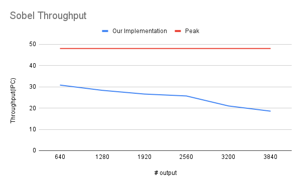
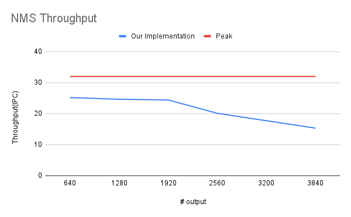

## Machine

```
hostname: ece019.ece.local.cmu.ed
```

## OpenCV Requirement

```
# 1) Get sources
git clone https://github.com/opencv/opencv.git
cd opencv
mkdir -p build && cd build

# 2) Configure: disable CUDA/OpenCL/OpenGL/Vulkan, keep only CPU+SIMD
cmake -S .. -B . \
  -D CMAKE_BUILD_TYPE=Release \
  -D CMAKE_INSTALL_PREFIX=/usr/local \
  \
  -D WITH_CUDA=OFF \
  -D WITH_CUDNN=OFF \
  -D OPENCV_DNN_CUDA=OFF \
  -D WITH_OPENCL=OFF \
  -D WITH_OPENGL=OFF \
  -D WITH_VULKAN=OFF \
  -D WITH_OPENVX=OFF \
  -D WITH_HALIDE=OFF \
  -D WITH_IPP=OFF \
  -D WITH_TBB=OFF \
  -D CPU_BASELINE=SSE4_2 \
  -D CPU_DISPATCH="AVX;AVX2;FMA3;AVX512_SKX" \
  -D ENABLE_FAST_MATH=ON \
  -D BUILD_TESTS=OFF \
  -D BUILD_PERF_TESTS=OFF \
  -D BUILD_EXAMPLES=OFF \
  -D BUILD_LIST=core,imgproc


# 3) Build & install
cmake --build . -j$(nproc)
sudo cmake --install .
```


## Build and Run

### Build
```
mkdir build
cd build
cmake ..
cmake --build . --config Release # build the whole project
```

### Correctness Testing
This will test the correctness for a random image. 
```
cmake --build . --target test_sobel 
./test_sobel

cmake --build . --target test_nms
./test_nms
```

### Performance Testing 
This will output the throughput of designed kernel and the speedup over OpenCV. 
```
cmake --build . --target test_performance_sobel 
./test_performance_sobel

cmake --build . --target test_performance_nms
./test_performance_nms
```

## Results

### Sobel Performance



The Sobel kernel achieves sustained throughput ranging from ~31 PPC (pixels per cycle) at small image sizes down to ~19 PPC at larger sizes. After the number of output exceeds the one way size of L1 cache, the throughput shows notable decreasement.


The peak of NMS kernel is 32. We achieve a considerable throughput around 25 when the data can perfectly fit in the L1 cache.
